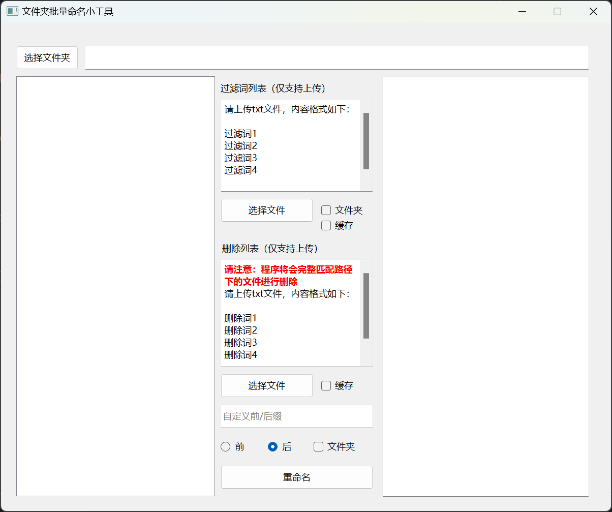

---
miniRenameTool
---

### 关于

---

这是一款Windows GUI小工具，用于批量重命名指定文件夹下的所有内容。功能包括：
1. 自定义追加前后缀
2. 关键词列表指定删除，支持文件夹
3. 关键词列表指定替换，支持文件夹

目前只是一个初始化版本，后续根据需要进行优化。

### TODO

---

1. 更优的代码与性能
2. 支持正则替换等高阶操作
3. 支持自动检查更新并升级
4. 支持指定递归深度
5. 支持导出结果为CSV、TXT等类型文件
6. 支持文件夹自定义过滤
7. 支持指定类型文件不追加自定义名称
8. 支持解压缩
9. More...

### 运行环境

---

- Python3.10+
- PyQT 6.0+

### 构建

---

使用 Cx-Freeze 进行构建

